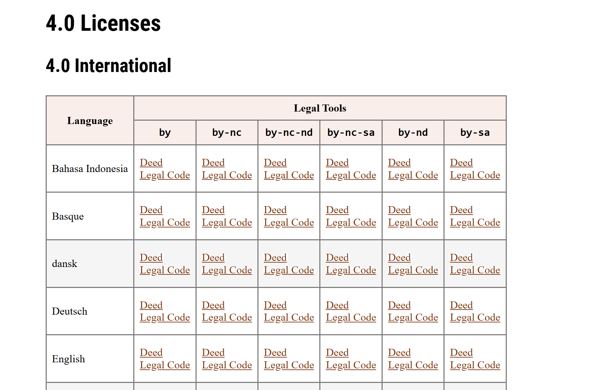

# Arcinsys Workflow

## Wozu mit Arcinsys arbeiten?

Arcinsys ist ein webbasiertes Archivsystem, das entwickelt wurde, um den Zugang zu Archivmaterialien einfacher und effizienter zu gestalten. Es ermöglicht Nutzer\*innen, historische Dokumente und Bestände in verschiedenen Archiven online zu recherchieren, zu verwalten und Nutzungsanfragen zu stellen. Nach erfolgreicher Nutzungsbeantragung haben Sie die Möglichkeit, bequem von überall aus auf die archivierten Dokumente - sogenannte Archivalien - zuzugreifen. Der Zugriffsstatus kann dabei transparent nachvollzogen werden.

 

>In diesem kurzen Workshop erhalten Sie einen Überblick darüber, wie Sie sich in Arcinsys orientieren, Bestände recherchieren, persönliche Merklisten anlegen und Anfragen für Archivgut erstellen können, sodass Sie das System mithilfe dieser Funktionen im Anschluss effektiv in Ihren Workflow einbinden können. :-)

## Registrierung

Erst als im System angemeldete Nutzer*in erhalten Sie neben der Bestandsrecherche auch die Möglichkeit, Archivalien zu bestellen und einzusehen. Registrieren Sie sich hierfür auf der Plattform des [Archivinformationssystems des Bundeslandes SH](https://arcinsys.schleswig-holstein.de/arcinsys/start.action#:~:text=Arcinsys%20ist%20ein%20Archivinformationssystem%20der%20Landesarchive%20Hessen,%20Niedersachsen)

## Benutzeroberfläche und Navigation

Nach Anmeldung gelangen Sie zur Benutzeroberfläche, auf der Sie zwischen den Oberflächen _Navigator_, _Suche_, _Merkliste_, _Beantragen_ und _Nutzen_ navigieren können:

>Einen organisierten Überblick über alle Funktionen erhalten Sie in diesem [Tutorial](https://www.arcinsys.de/docs/tutorial/tutorial_nla_sh.pdf) oder in etwas unübersichtlicher, aber noch detailreicherer Form im [Handbuch](https://www.arcinsys.de/help/arcinsyshandbuch_v26.pdf). Bei Fragen lohnt es sich, dort einen Blick reinzuwerfen. :-)

 

Die wichtigsten Arbeitsschritte, werden in den folgenden Kapiteln zusammengefasst.

Unter dem Menüpunkt _Navigator_ können Sie sich durch die beteiligten Archive klicken:

 

**1. Ebene: Die gegliederte Archivlandschaft**

 

**2. Ebene: Die Gliederung der Bestände eines ausgewählten Archivs**

 

**3. Ebene: Die einzelnen Archivalien innerhalb eines ausgewählten Bestands**

 

>Untergeordnete Materialien lassen Sie sich unter _Navigator_ auflisten. Unter _Detailseite_ können Sie die Metadaten und weitere Informationen zum ausgewählten Bestand oder der Archivalie einsehen: 

 

>Für die kollaborative Recherchearbeit können Sie Informationen zu Beständen an eine Mail-Adresse Ihrer Wahl versenden (auch die eigene kann gewählt werden):

## Such- und Filterfunktionen

Um nach konkreten Archivalien zu suchen, stehen Ihnen drei mögliche Suchoptionen zur Auswahl: Die _Einfache Suche_, die _Signatur-Suche_ und die _erweiterte Suche_.

Die Funktionsweise ist sehr intuitiv und selbsterklärend. 

- Es ist allerdings bei der erweiterten Suche darauf zu achten, bei Eingabe einer Archiv- oder Bestand-Signatur den Suchbereich _Folgende Auswahl_ auszuwählen - ansonsten wird die Eingabe vom System ignoriert.
- Sie können die Suchwörter am Ende mit einem * als Platzhalter versehen, um sich alle Suchergebnisse mit entsprechendem Wortbeginn anzeigen zu lassen.
- Für eine inklusive Oder-Suche können Sie ein OR zwischen die Wörter setzen.
- Wenn Eingaben mit einer bestimmten Wort-Reihenfolge gesucht werden sollen, umschließen Sie die Zeichenkette mit Anführungszeichen.

 

Die Suchergebnisse werden in einem Facettierungsbaum nach Häufigkeit ihrer Treffer gelistet aufgeführt.

 
Um später auf bestimmte Suchen zurückgreifen zu können, lässt sich jede Suche unter _Suche speichern_ mit einem prägnanten Namen versehen und abspeichern:

## Archivalien merken

>Als persönliches Hilfsmittel zur organisierten Recherche, können Sie Ihre von der Bestellliste unabhängige Merkliste befüllen. Klicken Sie hierfür bei einer Verzeichnung auf den Button _Merken_.

>Wenn Sie möchten, können Sie anschließend einzelne Archivalien aus ihrer Merkliste auf die Bestellliste setzen und gegebenenfalls einen Nutzungsantrag stellen.

## Archivalien bestellen
Für die Nutzung von Materialien ist _immer_ eine Kontaktaufnahme mit dem betreffenden Archiv notwendig. 

>Unter _Beantragen_ können Sie ihre bereits gestellten Nutzungsanträge einsehen, den Status prüfen oder einen neuen Antrag bei beteiligten Archiven stellen. 

 

>Für einige Archive ist das Ausfüllen eines Nutzungsformulars ausreichend - hier erhalten Sie nach Bestellung direkt Zugang zur Einsicht. Bei manchen Archivalien wird hingegen sogar eine "besondere Berechtigung" verlangt (z. B. eine Schutzfristenverkürzung), wofür Sie sich außerhalb von Arcinsys an das Archiv wenden. Einen Überblick über das Vorgehen für einen Antrag auf Schutzfristenverkürzung finden Sie [hier](https://www.arcinsys.de/tutorial/tutorial_07_07.php).

 

>In Ihrem _Bestellkorb_ (Einkaufskorb-Symbol oben rechts) können Sie Archivalien sammeln, die Sie einsehen möchten. Indem Sie die Bestellung abschicken, wird die Bestellung bei bereits vorhandenem Antrag direkt an das Archiv übermittelt. Ansonsten können Sie auch noch im Bestellvorgang den Nutzungsantrag oder das Nutzungsformular ausfüllen.

## Korrekte Quellenangaben

Möchten Sie Ihre Recherecheergebnisse weiterverarbeiten, so ist es notwendig, eine korrekte wissenschaftliche Veröffentlichung sicherzustellen!

>Archivalien werden in der Regel nach dem Schema *Archivname, Bestand, Signatur, ggf. Seite* zitiert.
>
>Falls die Dokumente unter einer bestimmten Lizenz (z. B. Creative Commons) veröffentlicht werden, sollte diese in der Quellenangabe vermerkt sein.
>Einen Überblick über die verschiedenen Lizenzen erhalten sie [hier](https://creativecommons.org/licenses/?lang=de).
>
> 

